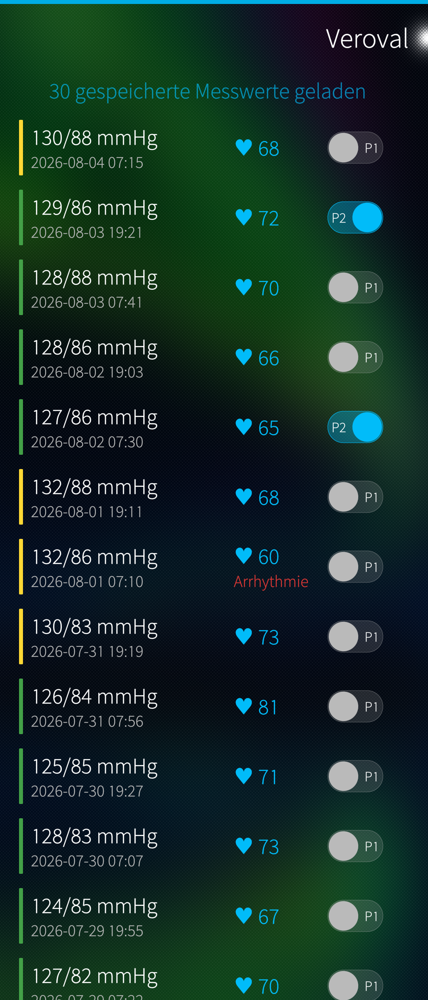
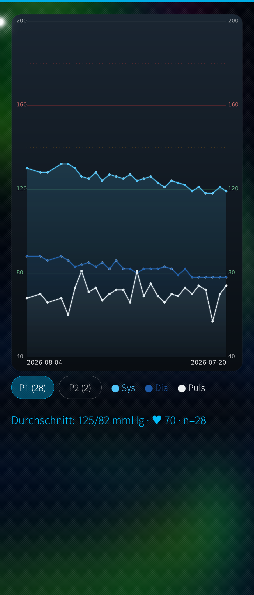
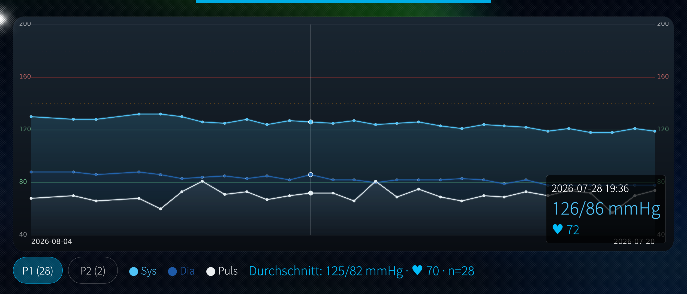

# svero

A native, **unofficial** Sailfish OS app that downloads the stored measurements
from a **Veroval** blood-pressure monitor over USB, charts them, and exports them.

It talks to the monitor's **Prolific PL2303** USB-serial bridge **directly via
the kernel's raw `usbdevfs` interface** — no `libusb` and no in-kernel `pl2303`
driver are required (neither is present on a stock device).

<p>

&nbsp;

</p>

<p>

</p>

*(Screenshots show generated sample data, and a German system language — the
app ships English and German.)*

## What works

* **Download over USB** — reads both memory banks (Person 1 *and* Person 2)
  and merges them.
* **Growing archive** — the device only holds ~99 readings; each download is
  **merged** into a persistent local archive (de-duplicated by person +
  timestamp), so you can accumulate months or a whole year across several
  downloads. Save/load named archive files to back up or combine series.
* **Chart** — systolic / diastolic / pulse over time, reached by swiping left.
  **Pinch** the chart to zoom the shown period (down to a week), **drag** it to
  move the window; tappable points with a detail read-out, a subtle “optimum”
  band around 120/80 and the hypertension thresholds (140 / 160 / 180) marked.
  Mirrored time axis (newest on the left).
* **Two people** — the monitor's own Person 1 / Person 2 banks are read as they
  are, and every reading additionally carries a P1/P2 switch you can correct
  yourself. The assignment is stored in the archive and survives further
  downloads; the chart shows one person at a time.
* **Exports** — CSV, and the chart as an image (JPG).
* A plausibility filter drops implausible records so averages stay clean.

## Requirements

* Sailfish OS (aarch64; developed/tested on 5.x).
* A Veroval monitor whose USB bridge enumerates as a Prolific PL2303
  (`067b:2303`) speaking the binary A5/A6 record protocol (e.g. the BPM-series).
  Other models — e.g. the *duo control*, which enumerates as CDC-ACM and uses an
  ASCII protocol — are **not** supported.
* A real **data** cable — a charge-only cable enumerates nothing.

## Using it

1. Plug the monitor into the phone (USB host mode) and put it into its
   PC/transfer mode.
2. Pull down → **Download from device**. Repeat over time; the archive grows.
3. Swipe left for the chart; pinch it to zoom and drag it sideways to pick a
   window.
4. **Save archive to file** / **Load archive file…** to back up or merge series.

A bundled udev rule (`data/999-veroval.rules`) makes the USB node accessible
without root. It is deliberately named `999-` so it sorts *after* the platform
rule that would otherwise force restrictive permissions on USB device nodes.

## Building

With the Sailfish SDK (Platform SDK / `mb2`):

```sh
mb2 -t SailfishOS-<version>-aarch64 build
```

Install the resulting RPM with `devel-su pkcon install-local <rpm>`. After
installing, reload udev: `udevadm control --reload-rules && udevadm trigger`.

The app runs **unsandboxed** (no Sailjail profile) so it can reach the raw USB
device node `/dev/bus/usb/*`.

## Attribution & licence

The wire protocol was reconstructed from community reverse-engineering — see
[ATTRIBUTION.md](ATTRIBUTION.md). Licensed **GPL-3.0-or-later**
([LICENSE](LICENSE)).
